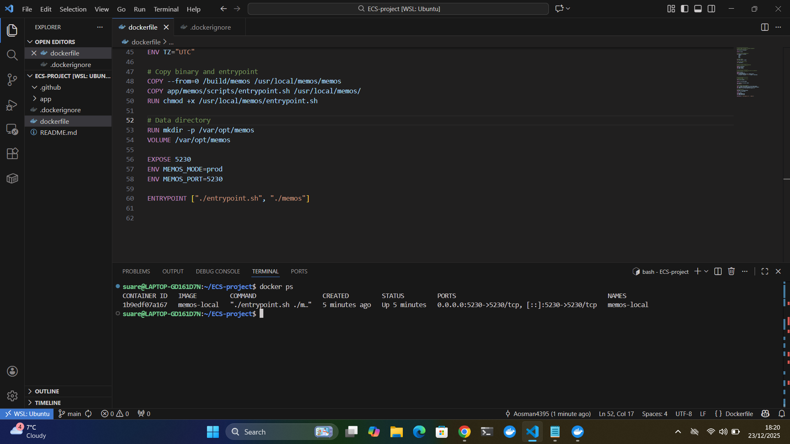
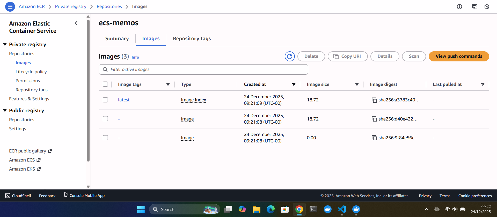
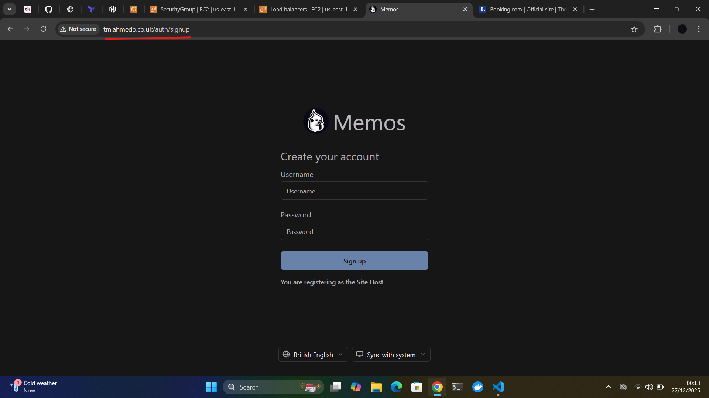
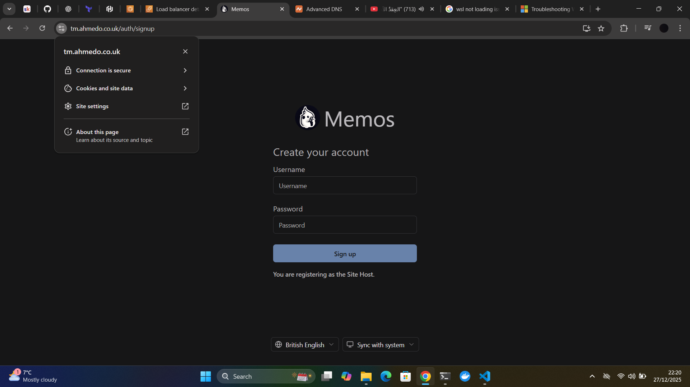
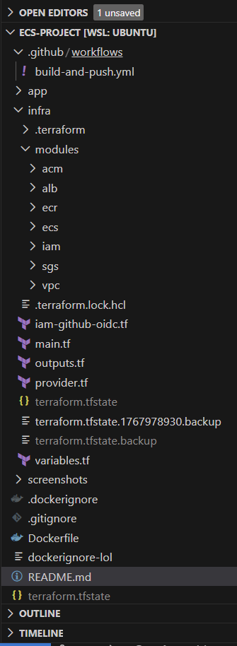
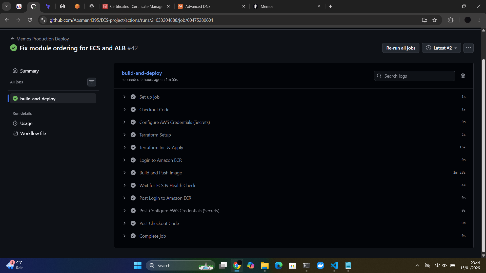
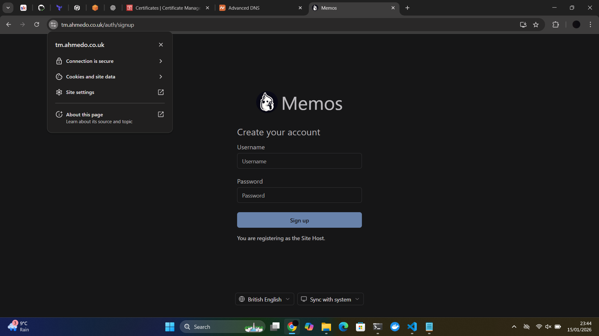
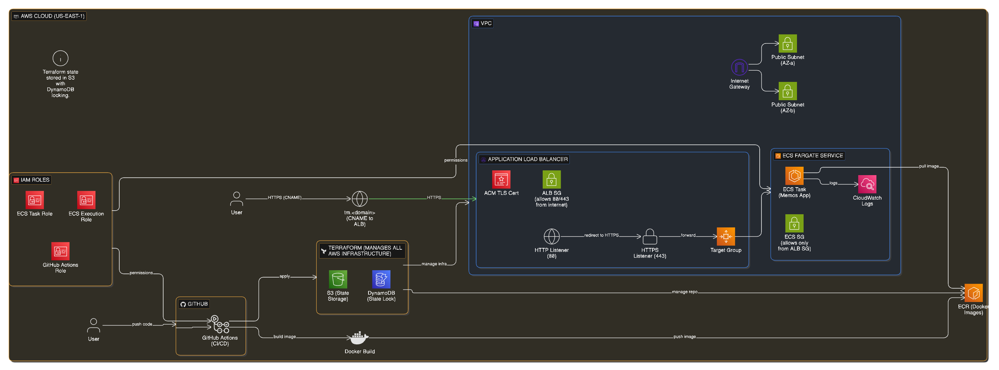

# Project Overview

This project demonstrates a production-style containerised application deployed on AWS using ECS, Terraform, and CI/CD.  

The primary focus is **infrastructure, automation, and deployment**, to replicate real production workload.

For the application layer, an existing lightweight open-source app is used as a deployable artifact.

---

## Application Choice

**App:** Memos  

**Reason for choice:**  

Memos is a simple, self-hosted application with minimal configuration and predictable HTTP behaviour, making it well-suited for an infrastructure-focused project.

The application is distributed as a Docker image, which aligns well with container-first deployment workflows.

---

## Phase 1 – Local Application Verification

**Goal:** Verify that the application runs locally and is accessible before any infrastructure or automation work.

### Local Setup

The application was run locally using the official Docker image:

```bash
docker run -d \
  --name memos \
  -p 5230:5230 \
  -v ~/.memos:/var/opt/memos \
  neosmemo/memos:stable

 ```

### Verification

The application was accessed successfully via a web browser at:

http://localhost:5230

An HTTP request was also made to a non-specific path to confirm the server responds when running:

curl http://localhost:5230/health

Although `/health` is not a dedicated health endpoint, the request returned a successful HTTP response, confirming that the application server is running and responding to requests.

### Result

- Application starts successfully in a Docker container
- HTTP server responds consistently when the app is running
- App accessible locally on port **5230**

## Phase 2 – Dockerisation & Local Validation

**Goal:** Successfully containerise and validate the application locally using Docker.

### Docker Image Build

The Docker image was built from the repository root using the following command:

```bash
docker build -t memos-local .
```
### Verification

The container was verified to be running successfully using the following command:

```bash
docker ps
```



## Phase 3 – Container Image Stored in Amazon ECR

**Goal:** Push the Docker image to Amazon Elastic Container Registry (ECR), making it available for deployment using AWS ECS.

### Amazon ECR Overview

Amazon ECR is used as a private container registry to securely store Docker images within AWS.  

Storing the image in ECR allows ECS to pull and run the application independently of the local development environment.

### Image Tag Used

The image was pushed using the **`latest`** tag.

This tag represents the **current stable version** of the application for this project and will be referenced in the ECS task definition in the next phase.

### Verification (AWS Console)

The successful image push was verified using the AWS Management Console.



## Phase 4 – Manual AWS Deployment (ClickOps)

**Goal:** Manually deploy the containerised application to AWS using the AWS Management Console (ClickOps). This phase focuses on understanding how all AWS components integrate together without Infrastructure as Code.

---

### Resources created:

- **Amazon ECR repository**
  - Used to store the production Docker image.
  - The ECS service pulls the image directly from ECR at runtime.

- **Amazon ECS Cluster (Fargate)**
  - Chose **AWS Fargate** to run containers serverlessly without managing EC2 instances.
  - Provides automatic scaling and infrastructure abstraction.

- **ECS Task Definition**
  - Defined container settings including:
    - Image from Amazon ECR
    - Container port `5230`
    - CPU and memory allocation
    - CloudWatch logging
  - This acts as the blueprint for running the container.

- **Application Load Balancer (ALB)**
  - Internet-facing ALB created to route external traffic to ECS tasks.
  - Listener configured for HTTP and HTTPS.
  - Target group created to forward traffic to the container on port `5230`.

- **Security Groups**
  - Inbound rules allow:
    - HTTP (80)
    - HTTPS (443)
  - Ensures public access while maintaining controlled network boundaries.

- **Configured DNS using Namecheap (instead of Route 53)**
  - An existing domain was already managed via **Namecheap**.
  - A **CNAME record** (`tm.<domain>`) was created pointing to the ALB DNS name.
  - This replaces the need for Route 53 while achieving the same result.

- **Attached an ACM Certificate for HTTPS**
  - AWS Certificate Manager (ACM) used to provision a TLS certificate.
  - Certificate attached to the ALB HTTPS listener.
  - Enables secure HTTPS access to the application.

---

### Verification

- ECS task is running and healthy.
- Target group shows healthy targets.
- Application is accessible via the custom domain.
- HTTPS is enabled and secured using ACM.

---
Application running via custom domain



Application running securely over HTTPS (ACM enabled)




## Phase 5 – AWS Infrastructure (Round 2) (IaC – Terraform)

**Goal:** Rebuild the entire ClickOps infrastructure using Terraform. The goal is to make the infrastructure reproducible, version-controlled, and fully automated.

---

### Terraform Overview

Terraform is used to manage AWS infrastructure using code instead of the AWS console.

From this point onward:

- No manual AWS configuration is performed.
- Terraform is the single source of truth.

---

### Modules and Variables

Using **modules** and **variables** keeps the Terraform code:

- DRY (Don’t Repeat Yourself)
- Reusable
- Easier to maintain and update
- Cleaner and more readable

### Infrastructure Rebuilt with Terraform

Terraform now manages:

- VPC and networking  
- Security groups  
- ECR repository  
- Application Load Balancer  
- Target group and listeners  
- ACM certificate  
- IAM roles  
- ECS cluster, task definition, and service  

All components that were previously created using ClickOps are now created and managed through Terraform.

---


### Root Files and DRY Design

- **main.tf**
  - Connects all modules together to form the full architecture.
  - Passes outputs between modules (e.g., VPC IDs, subnet IDs, target group ARN).

- **provider.tf**
  - Defines the AWS provider, region, and provider configuration in one place.

- **outputs.tf**
  - Exposes useful values for visibility and debugging (e.g., ALB DNS name, ECR URL).

- **variables.tf**
  - Stores configurable values (region, ports, domain, image tag) to avoid hard-coding.

### Terraform Project Structure




### Verification

After running:

`terraform init`

`terraform apply`  

The following was verified:

- All Terraform resources were created successfully with no errors.
- VPC, security groups, ALB, ECS, ECR, IAM, and ACM resources exist in AWS.
- ECS service is running and has healthy tasks.
- ALB target group shows healthy targets.
- Application is reachable through the load balancer.
- No manual AWS configuration was required after Terraform apply.


## Phase 6 – CI/CD Automation

**Goal:** Fully automate deployments using GitHub Actions.  

Pushing to the `main` branch now triggers a full production deployment.

---

### Pipeline Overview

The CI/CD pipeline is responsible for:

- Authenticating with AWS  
- Running Terraform to create or update infrastructure  
- Building the Docker image  
- Tagging the image with the Git commit SHA  
- Pushing the image to Amazon ECR  
- Updating the ECS service  
- Verifying the deployment with a health check  

---

### Terraform State in the Pipeline

When the pipeline runs Terraform, state is stored remotely.

- Terraform state is kept in an S3 bucket.
- State locking is handled using DynamoDB.

This ensures:

- Only one pipeline run can modify infrastructure at a time.
- Concurrent runs do not clash.
- Duplicate resource creation errors are avoided.
- Terraform always knows what already exists.

As a result, pipeline deployments are:

- Safe from race conditions  
- Free from duplicate resource errors  
- Consistent on every run  

---

### Verification

The CI/CD pipeline was verified by observing a successful end-to-end run in GitHub Actions.

- Terraform completed without errors.
- Docker image was built and pushed to ECR.
- ECS service updated successfully.
- Health check passed.

Successful pipeline run:




## Conclusion

This project demonstrates a full production-style cloud deployment using modern DevOps practices.

The application is now:

- Containerised with Docker  
- Stored in Amazon ECR  
- Deployed on ECS using Fargate  
- Exposed through an Application Load Balancer  
- Secured using HTTPS with ACM  
- Automated using Terraform and GitHub Actions  

The entire infrastructure can be recreated from scratch using Terraform, and every deployment is handled automatically through the CI/CD pipeline.

This project proves:

- Strong understanding of AWS core services  
- Infrastructure as Code using Terraform  
- CI/CD automation using GitHub Actions  
- Secure HTTPS configuration using ACM  
- Real-world troubleshooting and debugging skills  

Final result:  
The application is live, stable, and securely accessible over HTTPS.

Application running with ACM (HTTPS enabled):



## Architecture

Production AWS architecture using ECS Fargate, ALB, Terraform, and GitHub Actions in us-east-1.


