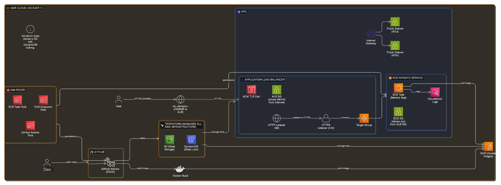
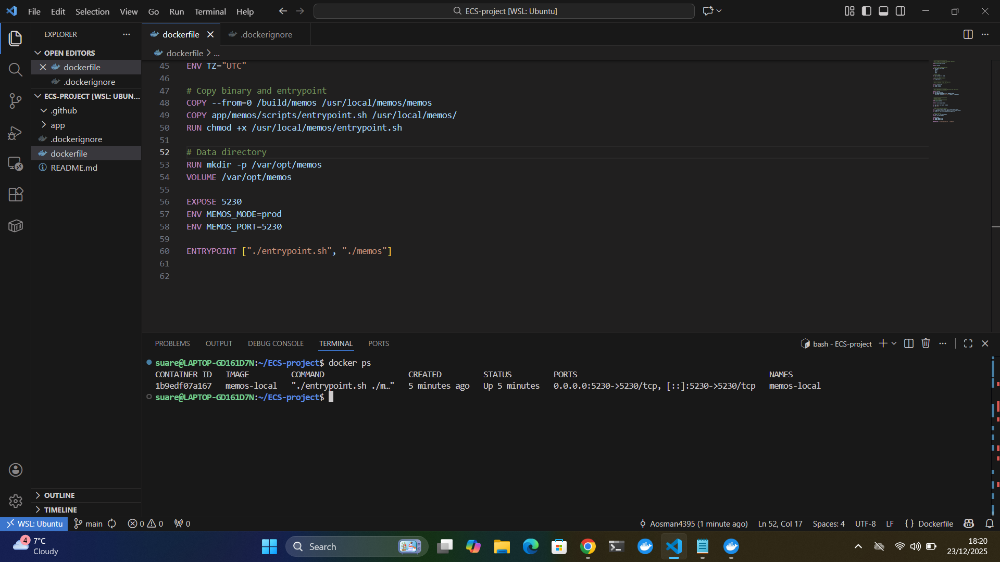
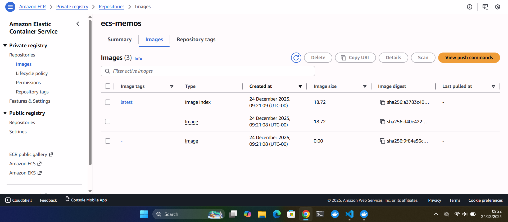
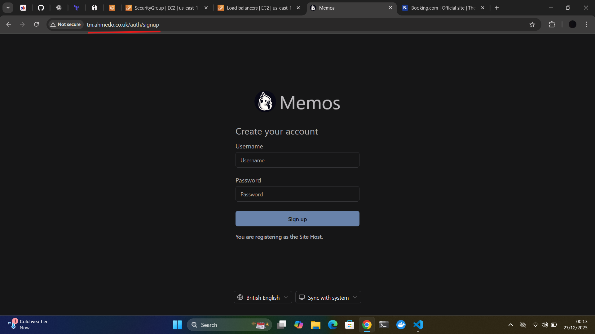
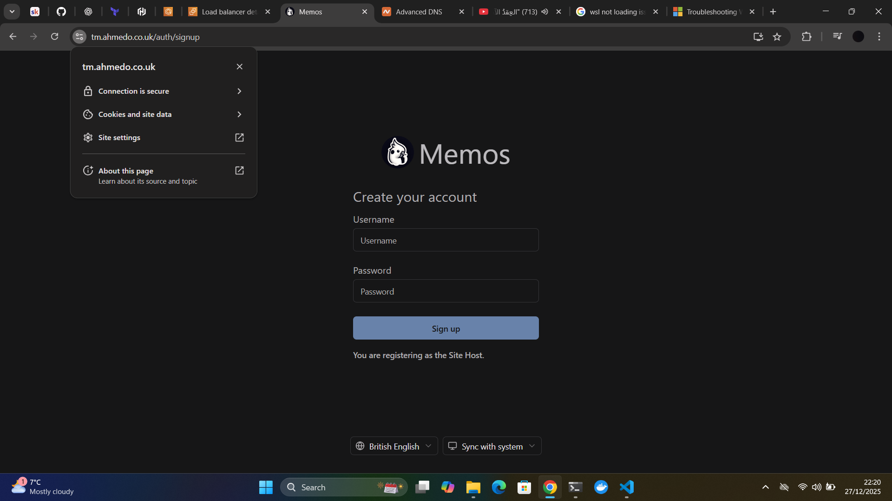
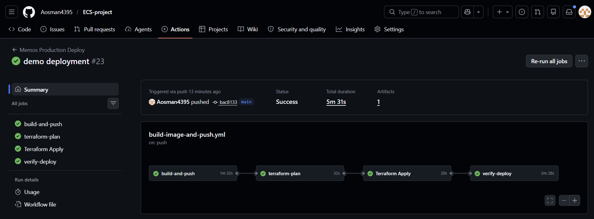
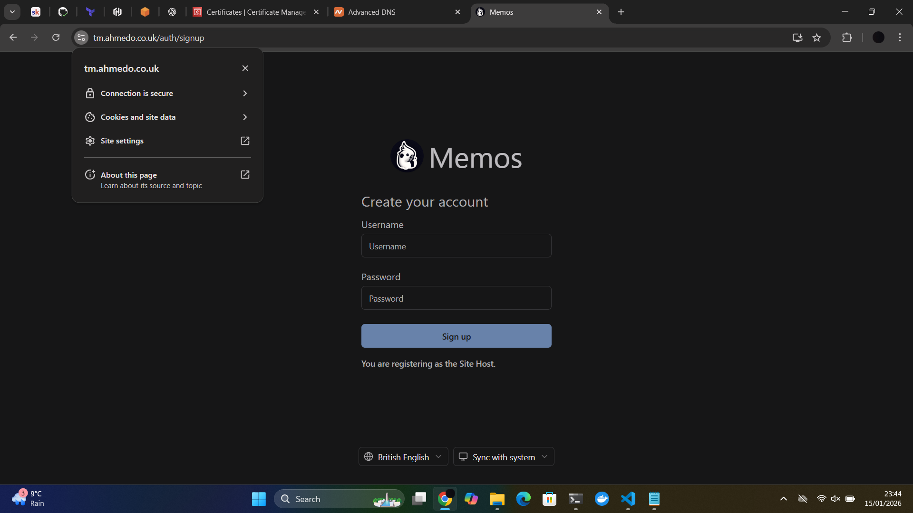

## 📚 Contents

- [Project Overview](#project-overview)
- [Application Selection](#application-selection)
- [Project Demo](#project-demo)
- [Architecture](#architecture)
- [Terraform Project Structure](#terraform-project-structure)
- [Phase 1 – Local Application Verification](#phase-1--local-application-verification)
- [Phase 2 – Dockerisation & Local Validation](#phase-2--dockerisation--local-validation)
- [Phase 3 – Container Image Stored in Amazon ECR](#phase-3--container-image-stored-in-amazon-ecr)
- [Phase 4 – Manual AWS Deployment (ClickOps)](#phase-4--manual-aws-deployment-clickops)
- [Phase 5 – AWS Infrastructure (Round 2) (IaC – Terraform)](#phase-5--aws-infrastructure-round-2-iac--terraform)
- [Phase 6 – CI/CD Automation](#phase-6--cicd-automation)
- [Conclusion](#conclusion)


## Project Overview

This project represents a production-style cloud infrastructure engagement for a client requiring a secure, scalable, and automated deployment of a containerised web application on AWS.

The objective was to design and implement a resilient ECS-based architecture using Infrastructure as Code, enabling repeatable deployments, environment consistency, and CI/CD-driven automation.

The focus of this project included:

- Designing and provisioning scalable, secure AWS infrastructure
- Implementing reusable Terraform modules for clean Infrastructure as Code
- Automating build and deployment workflows using CI/CD pipelines
- Ensuring high availability through load balancing and networking best practices
- Following production-style cloud architecture patterns and operational standards

---

## Application Selection

**Application:** Memos  

Memos is a lightweight, self-hosted note-taking application that allows users to create, organise, and store short notes. It’s often used as a personal knowledge base or internal tool for keeping track of information.

---

## Project Demo

https://www.loom.com/share/411a7d5535a848fb8be2147108ad54e4

## Architecture

Production AWS architecture using ECS Fargate, ALB, Terraform, and GitHub Actions in us-east-1.



---

### Project Structure

```
.
├── .github/
│ └── workflows/
│ └── build-image-and-push.yml  `CI/CD pipeline (build, plan, apply, verify)`
│
├── app/ `Application source code`
│
├── infra/
│ ├── bootstrap/ `One-time setup (S3 backend, IAM OIDC)`
│ ├── Main/ `Core Terraform configuration`
│ └── modules/ `Reusable Terraform modules`
│
├── screenshots/  `Project verification images`
│
├── Dockerfile `Container build configuration`
├── .dockerignore `Docker ignore rules`
├── .gitignore `Git ignore rules`
└── README.md `Project documentation`

```
---

## Phase 1 – Local Application Verification

**Goal:** Verify that the application runs locally and is accessible before any infrastructure or automation work.

### Local Setup

The application was run locally using the official Docker image:

```bash
docker run -d \
  --name memos \
  -p 5230:5230 \
  -v ~/.memos:/var/opt/memos \
  neosmemo/memos:stable

 ```

### Verification

The application was accessed successfully via a web browser at:

http://localhost:5230

### Result

- Application starts successfully in a Docker container
- HTTP server responds consistently when the app is running
- App accessible locally on port **5230**

## Phase 2 – Dockerisation & Local Validation

**Goal:** Successfully containerise and validate the application locally using Docker.

### Docker Image Build

The Docker image was built from the repository root using the following command:

```bash
docker build -t memos-local .
```
### Verification

The container was verified to be running successfully using the following command:

```bash
docker ps
```



## Phase 3 – Container Image Stored in Amazon ECR

**Goal:** Push the Docker image to Amazon Elastic Container Registry (ECR), making it available for deployment using AWS ECS.

### Amazon ECR Overview

Amazon ECR is used as a private container registry to securely store Docker images within AWS.  

Storing the image in ECR allows ECS to pull and run the application independently of the local development environment.

### Image Tag Used  

The image is tagged using the **Git commit SHA**.

Each build generates a unique, immutable image tag based on the commit, ensuring:

- Every deployment is traceable to a specific code change  
- No risk of overwriting previous images  
- Easy rollback to a known working version  

This image tag is dynamically passed to the ECS task definition during deployment via the CI/CD pipeline.


### Verification (AWS Console)

The successful image push was verified using the AWS Management Console.



## Phase 4 – Manual AWS Deployment (ClickOps)

**Goal:** Manually deploy the containerised application to AWS using the AWS Management Console (ClickOps). This phase focuses on understanding how all AWS components integrate together without Infrastructure as Code.

---

### Resources created:

- **Amazon ECR repository**
- **Amazon ECS Cluster (Fargate)**
- **ECS Task Definition**
- **Application Load Balancer (ALB)**
- **Security Groups**
- **Configured DNS using Namecheap (instead of Route 53)**
- **Attached an ACM Certificate for HTTPS**

---

### Verification

- ECS task is running and healthy.
- Target group shows healthy targets.
- Application is accessible via the custom domain.
- HTTPS is enabled and secured using ACM.

---
Application running via custom domain



Application running securely over HTTPS (ACM enabled)




## Phase 5 – AWS Infrastructure (Round 2) (IaC – Terraform)

**Goal:** Rebuild the entire ClickOps infrastructure using Terraform. The goal is to make the infrastructure reproducible, version-controlled, and fully automated.

---

### Terraform Overview

Terraform is used to manage AWS infrastructure using code instead of the AWS console.

From this point onward:

- No manual AWS configuration is performed.
- Terraform is the single source of truth.

---

### Bootstrap Layer (Foundation)

Before provisioning the main infrastructure, a bootstrap phase was introduced to solve the initial dependency problem.

Certain resources must exist before Terraform and CI/CD can run properly.

The bootstrap layer was applied once manually and is responsible for:

- Creating the S3 bucket for Terraform remote state  
- Enabling encryption and versioning  
- Creating IAM roles for GitHub Actions (OIDC)  
- Establishing trust between GitHub and AWS  

This ensures all future Terraform runs are:

- Remote and consistent  
- Secure (no long-lived credentials)  
- Ready for CI/CD automation  

![bootstrap(screenshots/bootsrap.png)]

### Modules and Variables

Using **modules** and **variables** keeps the Terraform code:

- DRY (Don’t Repeat Yourself)
- Reusable
- Easier to maintain and update
- Cleaner and more readable

### Root Files and DRY Design

- **main.tf**
  - Connects all modules together to form the full architecture.
  - Passes outputs between modules

- **provider.tf**
  - Defines the AWS provider, region,backend and provider configuration in one place.

- **outputs.tf**
  - Exposes useful values for visibility and debugging

- **variables.tf**
  - Stores configurable valueso avoid hard-coding

### Infrastructure Rebuilt with Terraform

Terraform now manages:

- VPC and networking  
- Security groups  
- ECR repository  
- Application Load Balancer  
- Target group and listeners  
- ACM certificate  
- IAM roles  
- ECS cluster, task definition, and service  

All components that were previously created using ClickOps are now created and managed through Terraform.

---


### Verification  

The bootstrap layer was applied once manually to provision foundational resources required for Terraform and CI/CD.

Following this, all infrastructure changes are executed through the CI/CD pipeline.

The following was verified:

- Bootstrap successfully created the Terraform backend and IAM roles  
- Terraform configuration is valid and ready for automated execution  
- VPC, security groups, ALB, ECS, ECR, IAM, and ACM resources are defined and managed through Terraform  
- ECS cluster and service configuration is correctly set up  

Full deployment, infrastructure updates, and application verification are handled in the next phase via the CI/CD pipeline.

## Phase 6 – CI/CD Automation  

**Goal:** Fully automate deployments using GitHub Actions.  

Pushing to the `main` branch now triggers a full production deployment pipeline.

---

### Pipeline Overview  

The CI/CD pipeline is responsible for:

- Authenticating with AWS using OIDC  
- Building and pushing the Docker image to Amazon ECR  
- Running Terraform plan to preview infrastructure changes  
- Applying Terraform changes to update infrastructure  
- Updating the ECS service with the new image  
- Verifying the deployment with a health check  

---

### Pipeline Flow  

The pipeline is split into clear stages to improve reliability and visibility:

1. **build-and-push**  
   - Builds Docker image  
   - Tags image using Git commit SHA  
   - Pushes image to Amazon ECR  

2. **terraform-plan**  
   - Runs `terraform plan`  
   - Shows infrastructure changes before applying  
   - Uses `-lock-timeout=5m` to handle state lock contention  

3. **terraform-apply**  
   - Applies infrastructure changes  
   - Updates ECS service with new image  

4. **verify-deploy**  
   - Waits for ECS service to stabilise  
   - Runs health check against application endpoint  
   - Fails pipeline if deployment is unhealthy  

---

### Verification  

The CI/CD pipeline was verified through a successful end-to-end deployment run:

- Docker image built and pushed to ECR  
- Terraform plan executed successfully  
- Infrastructure applied without errors  
- ECS service updated  
- Health check passed  

Successful pipeline run:




## Conclusion

This project demonstrates a full production-style cloud deployment using modern DevOps practices.

The application is now:

- Containerised with Docker  
- Stored in Amazon ECR  
- Deployed on ECS using Fargate  
- Exposed through an Application Load Balancer  
- Secured using HTTPS with ACM  
- Automated using Terraform and GitHub Actions  

The entire infrastructure can be recreated from scratch using Terraform, and every deployment is handled automatically through the CI/CD pipeline.

This project proves:

- Strong understanding of AWS core services  
- Infrastructure as Code using Terraform  
- CI/CD automation using GitHub Actions  
- Secure HTTPS configuration using ACM  
- Real-world troubleshooting and debugging skills  

Final result:  
The application is live, stable, and securely accessible over HTTPS.

Application running with ACM (HTTPS enabled):




